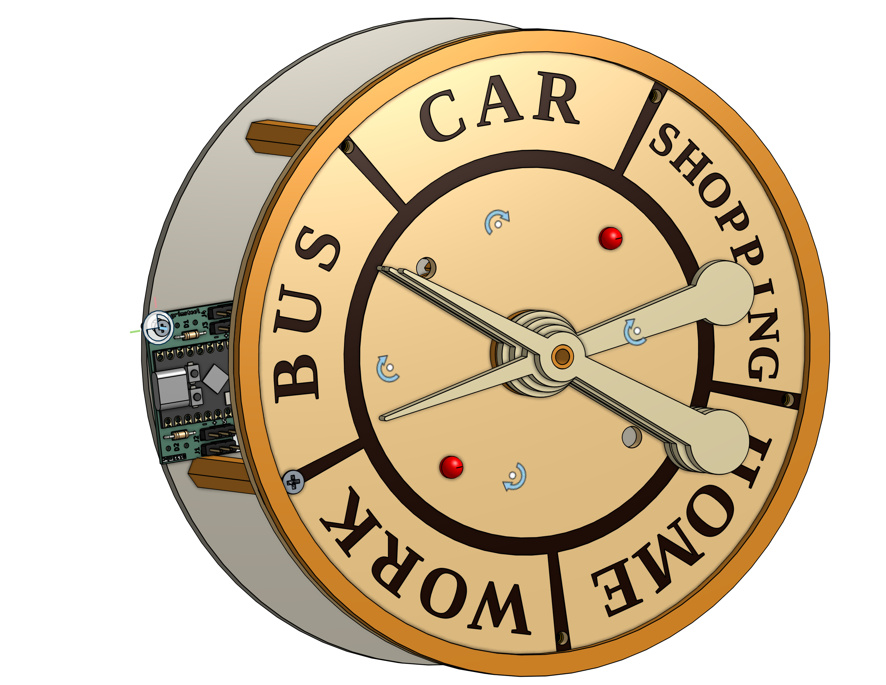
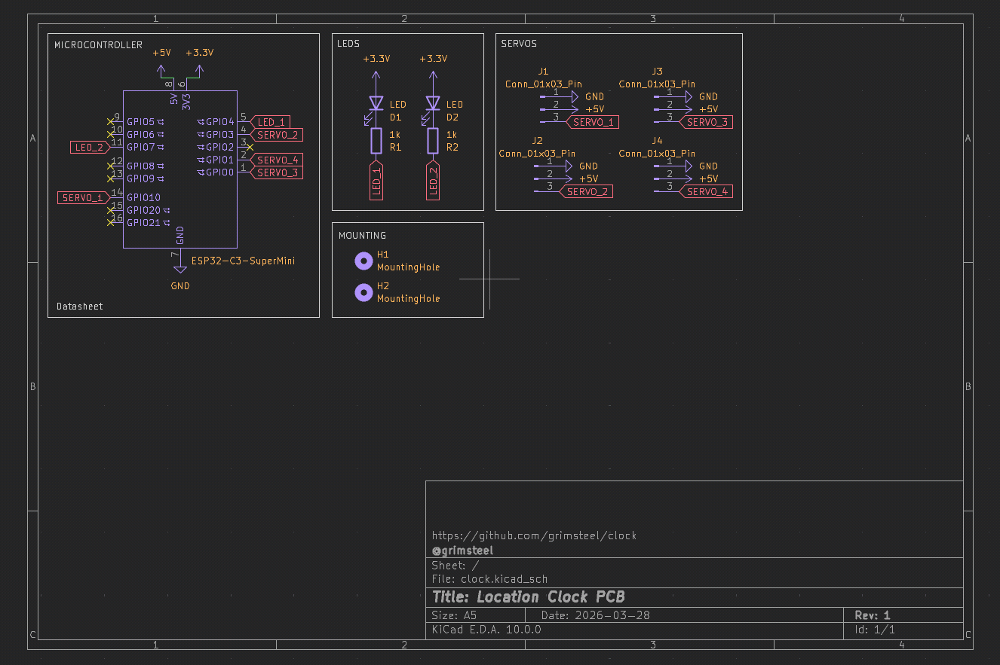
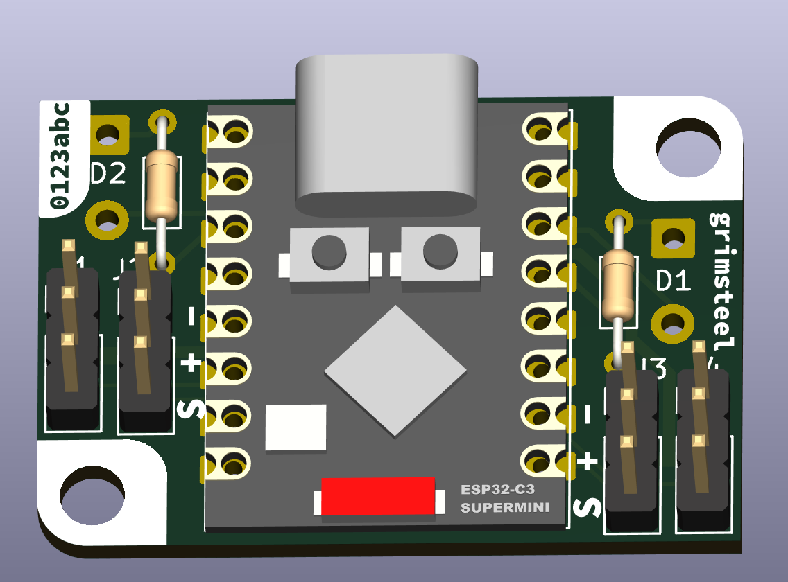
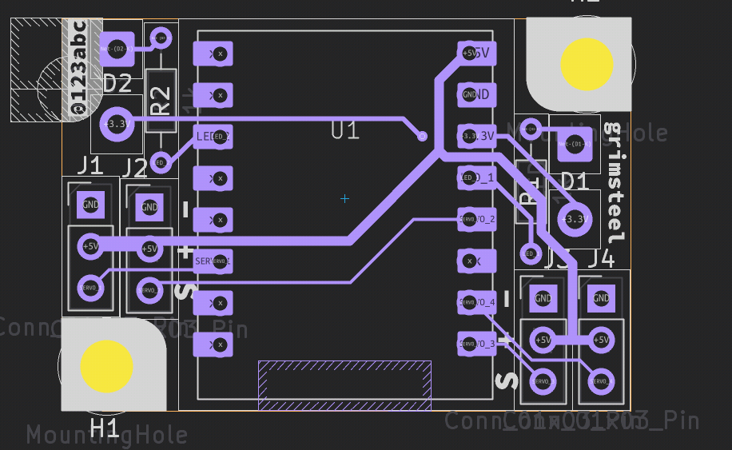
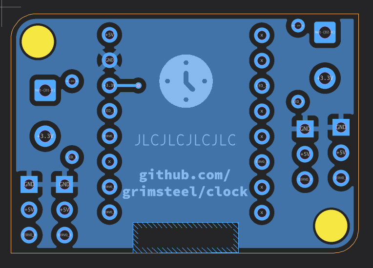

# Clock

> Working 4-person location clock. Uses Home Assistant location zone information.

## Usage

### Assembly

1. 3D-print and laser cut the necessary components (see the `cad/` folder for a parts list and Onshape link)
2. Solder the ESP32 and pin headers onto the PCB.
3. Assemble the back frame (back, PCB, standoffs, and servo mount)
4. Attach the servos to the servo mount
5. Add the shafts, placing PTFE washers in between
6. Attach the front frame
7. Attach the front decorations and the hands

### Using it

8. Install one of the provided firmwares, configuring the people/locations as necessary (see `firmware/README.md`)
9. Profit. This does rely on accurate zone information in Home Assistant.

## Technical Information

### Structure

More information can be found in the `cad/` folder. The clock consists of a laser cut front and back frame.

Each hand is controlled by a servo with a 2:1 gear ratio. The servos and gears are mouted on a 3d-printed frame, which is fastened to the back frame.

The hands are attached to four concentric shafs, each terminating at a different height. This is part of the reason the clock is so thick.

The front includes 4 possible mounting spots for LEDs.

### PCB

The PCB consists of a surface mounted ESP32 C3 Supermini with connections for the 4 servos and 2 LEDs:

| Schematic                               | 3D render                      |
|-----------------------------------------|--------------------------------|
|  |   |
| Front                                   | Back                           |
|          |  |

### Firmware

Two firmwares are provided: an ESPHome and a native ESP-IDF firmware. More information can be found in the `firmware/` folder.

## BOM

| Description                | Link                                                       | Per-unit price | Quantity | Total price | Running price w/ tax |
|----------------------------|------------------------------------------------------------|----------------|----------|-------------|----------------------|
| CAD components             | https://cad.onshape.com/documents/5b8ef3e45edb03dc1124a4e9 | $0.00          | 1        | $0.00       | $0.00                |
| PCB                        | https://oshpark.com                                        | $6.45          | 1        | $6.45       | $7.01                |
| ESP32-C3 Supermini         | https://www.aliexpress.us/item/3256806025345322.html       | $2.63          | 1        | $2.63       | $9.86                |
| MG90s Micro Servo (5 pack) | https://www.aliexpress.us/item/3256808303872992.html       | $9.86          | 1        | $9.86       | $20.57               |
| PTFE sheet (0.5x100x100mm) | https://www.aliexpress.us/item/3256803757155678.html       | $2.65          | 1        | $2.65       | $23.45               |
